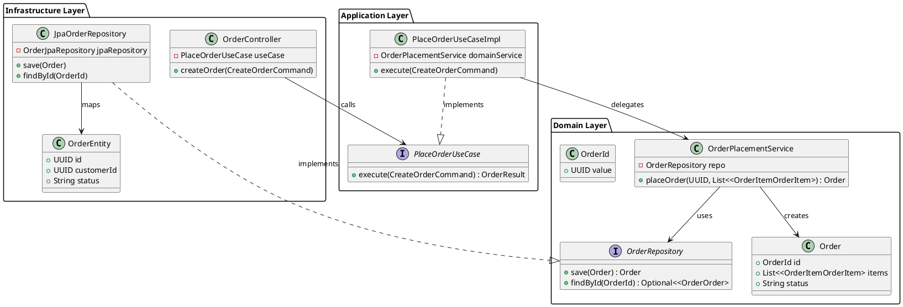

# Order Service (Java) - Reference Implementation

## Architecture Overview
This service implements a a strict Clean Architecture approach to ensure total isolation between business logic and infrastructure.

### Class Diagram

## Component Mapping
- **Controller**: Entry point, handles HTTP and DTO mapping.
- **UseCase**: Orchestrates the flow, manages transactions.
- **Domain Service**: Pure business logic, agnostic of any framework.
- **Port**: Interface defining how the domain needs to persist data.
- **Adapter**: Concrete JPA implementation of the repository.
