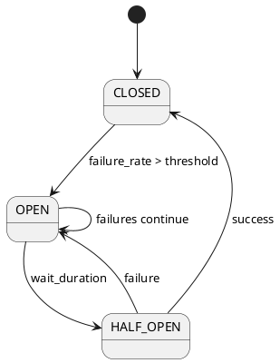
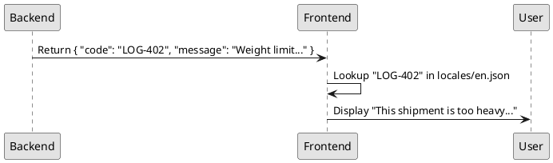
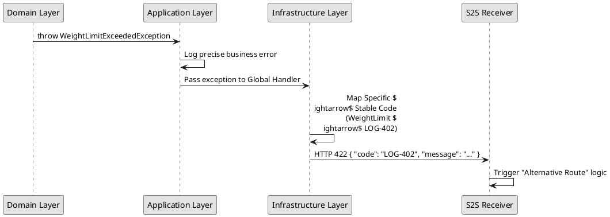
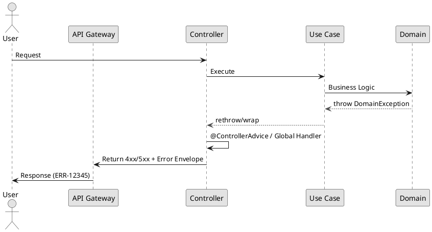

# Resilience & Observability Standards

## 1. Observability

### 1.1 Logging
- **Standard**: Use Log4j2.
- **Log Levels**:
  - `INFO`: High-level business milestones (e.g., "Order placed", "Payment processed").
  - `DEBUG`: Detailed technical flow for troubleshooting.
  - `WARN`: Recoverable issues or unexpected behavior that doesn't stop the flow.
  - `ERROR`: Unrecoverable failures requiring immediate attention.
- **Structured Logging**:
  - **Format**: All logs in production must be emitted as **NDJSON** (Newline Delimited JSON). Each log entry is a single JSON object on one line.
  - **Ingestion**: Designed for direct ingestion into Splunk/ELK.
- **Contextual Data (MDC)**: 
  - Use **MDC (Mapped Diagnostic Context)** to attach request-scoped metadata.
  - Every log line must include: `traceId`, `spanId`, `userId`, `tenantId`.
- **Prohibited**: Never log PII (emails, passwords, credit card numbers) or secrets.

**Recommended Schema**:
```json
{
  "timestamp": "2026-04-30T10:00:00.123Z",
  "level": "ERROR",
  "logger": "com.example.app.OrderService",
  "message": "Payment processing failed",
  "thread": "http-nio-8080-exec-1",
  "context": {
    "traceId": "a1b2c3d4e5f6",
    "spanId": "g7h8i9j0",
    "userId": "user-123",
    "tenantId": "tenant-abc"
  },
  "exception": {
    "class": "com.example.app.PaymentException",
    "message": "Insufficient funds",
    "stacktrace": "..."
  }
}
```

### 1.2 Metrics
- **Standard**: Use Micrometer with Prometheus.
- **Metric Types**:
  - **Counters**: Track event frequency (e.g., `orders_created_total`).
  - **Gauges**: Track current state (e.g., `active_threads`, `queue_depth`).
  - **Timers**: Track latency and distribution (e.g., `request_processing_time`).
- **Dimensions**: Use consistent tags (e.g., `service_id`, `region`, `endpoint`) for aggregation.

### 1.3 Distributed Tracing
- **Standard**: Micrometer Tracing (successor to Spring Cloud Sleuth) with OpenTelemetry (OTel) and Zipkin or Jaeger.
- **Correlation Injection**: 
  - Use Micrometer Tracing to automatically inject `traceId` and `spanId` into the **MDC (Mapped Diagnostic Context)**.
  - This ensures every log line emitted via Log4j2 automatically contains the current request's correlation IDs without manual coding.
- **Trace Propagation**: Every request must carry a `trace-id` across service boundaries via HTTP headers (B3 or W3C Trace Context), managed automatically by Micrometer.
- **Spans**: Create spans for significant units of work:
  - External API calls.
  - Database queries.
  - Complex business logic blocks.

---

## 2. Resilience Patterns

### 2.1 Circuit Breaker
- **Tool**: Resilience4j.
- **Purpose**: Prevent cascading failures by "tripping" the circuit when a downstream service is failing.
- **Configuration**:
  - **Failure Rate Threshold**: Trip circuit if >50% of requests fail.
  - **Slow Call Threshold**: Trip circuit if >50% of requests take longer than X seconds.
  - **Wait Duration**: Stay open for X seconds before attempting a "half-open" state.
- **Fallback**: Every circuit-protected call **must** have a fallback method to provide a graceful degradation (e.g., return cached data, default value, or a "service temporarily unavailable" message).

**Boilerplate Example**:
```java
@Service
public class OrderServiceClient {
    private final RestClient restClient;

    @CircuitBreaker(name = "orderService", fallbackMethod = "fallbackGetOrder")
    public OrderResponse getOrder(UUID id) {
        return restClient.get()
            .uri("/api/v1/orders/" + id)
            .retrieve()
            .body(OrderResponse.class);
    }

    public OrderResponse fallbackGetOrder(UUID id, Throwable t) {
        log.error("Order service unavailable for ID {}. Error: {}", id, t.getMessage());
        return new OrderResponse(id, "Status Unknown (Cached/Fallback)");
    }
}
```

### 2.2 Retry Mechanism
- **Tool**: Resilience4j / Spring Retry.
- **Application**: Use only for **idempotent** operations or transient failures (Network timeouts, 503 Service Unavailable).
- **Strategy**:
  - **Exponential Backoff**: Increase wait time between retries (e.g., 100ms, 200ms, 400ms).
  - **Jitter**: Add random noise to backoff to prevent "thundering herd" effect on the downstream service.
  - **Max Attempts**: Limit retries (typically 3) to avoid hanging the user request.
  - **Fallback Method**: When retry exhausted, use fallback to return graceful degradation response.

**Boilerplate Example**:
```java
@Service
@RequiredArgsConstructor
public class ExternalServiceClient {

    private final WebClient webClient;

    @CircuitBreaker(name = "externalApi", fallbackMethod = "fallbackCall")
    @Retry(name = "externalApiRetry", fallbackMethod = "retryFallbackCall")
    public <T> T callExternalSystem(String endpoint, T request, Class<T> responseType) {
        // ... request execution ...
    }

    public <T> T fallbackCall(String endpoint, T request, Class<T> responseType, Throwable t) {
        log.warn("Circuit breaker OPEN. Using fallback.");
        return createFallbackResponse(responseType);
    }

    public <T> T retryFallbackCall(String endpoint, T request, Class<T> responseType, Throwable t) {
        log.warn("Retry exhausted. Using fallback.");
        return createFallbackResponse(responseType);
    }
}
```

### 2.3 Timeouts
- **Rule**: Every external call (HTTP, DB, Cache) **must** have an explicit timeout.
- **Types**:
  - **Connect Timeout**: Time to establish the TCP connection.
  - **Read/Request Timeout**: Time to wait for the response after connection.
- **Sizing**: Set timeouts based on the 99th percentile (p99) of the downstream service's latency.

### 2.4 Bulkheads
- **Purpose**: Isolate failure to a specific pool of resources to prevent a single failing endpoint from consuming all server threads.
- **Implementation**: Use separate thread pools or semaphores for different external dependencies.

### 2.5 Circuit Breaker Configuration

**Resilience4j Configuration (application.yml)**:
```yaml
resilience4j:
  circuitbreaker:
    instances:
      externalApi:
        failure-rate-threshold: 50  # % of failures to open circuit
        minimum-number-of-calls: 5  # Calls needed before evaluating
        wait-duration-in-open-state: 5s  # Time before half-open test
        automatic-transition-from-open-to-half-open-enabled: true
        sliding-window-size: 10  # Number of calls in sliding window
  
  retry:
    instances:
      externalApiRetry:
        max-attempts: 3
        wait-duration: 2s
        retry-exceptions:
          - org.springframework.web.client.ResourceAccessException
          - java.net.TimeoutException
          - java.io.IOException
```

**Circuit Breaker States Flow**:


**Circuit Breaker Events**:
- **CLOSED**: Normal operation, requests pass through
- **OPEN**: Circuit tripped, requests fail fast
- **HALF_OPEN**: Testing if service recovered, limited requests allowed

---

### 4.6 Error Code and Message Ownership

To maintain consistency across multiple clients (Web, Mobile, S2S), the system follows a **Backend-Driven, Frontend-Localized** model.

#### Ownership Matrix
| Element | Owner | Responsibility | Example |
| :--- | :--- | :--- | :--- |
| **Error Code** | Backend | Define a unique, stable, machine-readable ID. | `LOG-402` |
| **Base Message** | Backend | Provide a technical description of the failure. | "Weight limit exceeded for zone X" |
| **User Message** | Frontend | Map the Code to a localized, user-friendly string. | "This shipment is too heavy for the selected route." |
| **I18n Key** | Frontend | Maintain the mapping in locale files. | `errors.logistics.weight_limit` |

#### Translation Flow


**Key Rule**: The Frontend must never "guess" the error based on the HTTP status code alone. It must always rely on the `code` provided in the response envelope.

### 4.2 Exception Categorization (Logistics Context)
| Category | Definition | Logistics Example | Action |
| :--- | :--- | :--- | :--- |
| **Transient** | Temporary failure, likely to succeed on retry | Warehouse API Timeout, Lock contention | Retry $\rightarrow$ Circuit Breaker |
| **Semantic** | Business rule violation | `WeightLimitExceededException`, `InvalidDeliveryZoneException` | Map to 4xx $\rightarrow$ User Notification |
| **Systemic** | Critical failure in infrastructure | Route Optimization Engine Down, DB Disk Full | Map to 5xx $\rightarrow$ Alert Ops |
| **Fatal** | Programming error / invariant violation | `NullPointerException` in Route Calculation | Fail fast $\rightarrow$ Log Stacktrace $\rightarrow$ Fix |

### 4.3 Hybrid Exception Hierarchy
To balance precision and maintainability, use a hierarchy where specific domain exceptions inherit from generic categories.

#### Hierarchy Diagram
```plantuml
@startuml
skinparam monochrome true
class BaseException <<(S, #ADD1B2)>
class DomainException extends BaseException <<(B, #B2C2EF)>
class InfrastructureException extends BaseException <<(I, #F2B2B2)>

package "Logistics Domain" {
    class ShipmentException extends DomainException
    class WeightLimitExceededException extends ShipmentException
    class RouteException extends DomainException
    class InvalidDeliveryZoneException extends RouteException
}

package "Infrastructure" {
    class ExternalServiceException extends InfrastructureException
    class WarehouseTimeoutException extends ExternalServiceException
}
@enduml
```

### 4.4 Boundary Mapping & S2S Translation
Exceptions must be translated at layer boundaries. For System-to-System (S2S) calls, internal specificity is mapped to a stable, machine-readable error code.

#### S2S Translation Flow


#### General Exception Flow


### 4.5 Batch Processing Exception Strategy
In batch contexts (e.g., bulk shipment processing), a single failure must not crash the entire process.

- **Skip Policy**: Identify "skippable" exceptions (e.g., a single shipment with an invalid address). Log the error, mark the item as failed, and continue.
- **Retry Policy**: For transient errors (e.g., temporary Warehouse API outage), retry the chunk/item.
- **Restartability**: Ensure the system can resume from the last successful commit point using a job repository.
- **Dead Letter Queue (DLQ)**: Move permanently failed items to a DLQ for manual intervention.

#### Batch Exception Decision Flow
```plantuml
@startuml
skinparam monochrome true
start
:Process Shipment Item;
if (Exception Occurs?) then (yes)
    if (Transient?) then (yes)
        :Increment Retry Count;
        if (Retry Limit Reached?) then (no)
            :Wait (Exponential Backoff);
            goto :Process Shipment Item;
        else (yes)
            :Move to DLQ;
            :Log Systemic Failure;
        endif
    elseif (Semantic/Business Rule?) then (yes)
        :Log "Invalid Item";
        :Increment Skip Count;
        :Mark Item as Failed;
        :Continue to Next Item;
    else (Systemic/Fatal)
        :Stop Entire Job;
        :Mark Job as FAILED;
        :Alert Operations;
        stop
    endif
else (no)
    :Commit Item Success;
endif
stop
@enduml
```
