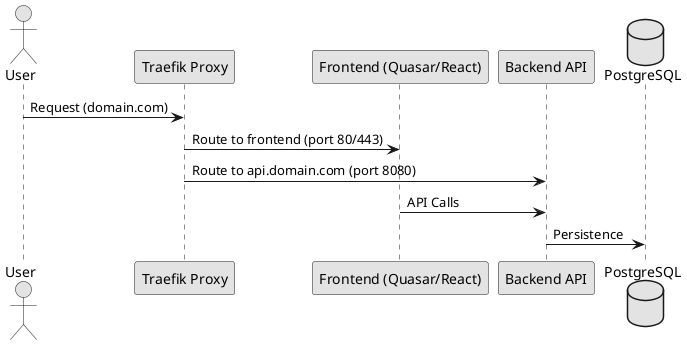

# Deployment Guidelines (Docker Compose & Traefik)

## 1. Architecture
We use Docker Compose for local development and small-scale deployments. Traefik acts as the edge router and reverse proxy, handling SSL termination and request routing to the frontend and backend.

## 2. Network Topology
All services must reside on a shared Docker network. Traefik communicates with services via Docker labels.



## 3. Docker Compose Configuration
Every project must provide a `docker-compose.yml` that follows these rules:

### 3.1 Traefik Setup
Traefik must be configured as the entry point.

```yaml
services:
  traefik:
    image: traefik:v2.10
    command:
      - "--providers.docker=true"
      - "--entrypoints.web.address=:80"
    ports:
      - "80:80"
      - "8080:8080" # Dashboard
    volumes:
      - /var/run/docker.sock:/var/run/docker.sock
```

### 3.2 Service Routing (Labels)
Services are discovered by Traefik using labels.

```yaml
services:
  backend:
    image: my-app-backend:latest
    labels:
      - "traefik.enable=true"
      - "traefik.http.routers.backend.rule=Host(`api.localhost`)"
      - "traefik.http.services.backend.loadbalancer.server.port=8080"

  frontend:
    image: my-app-frontend:latest
    labels:
      - "traefik.enable=true"
      - "traefik.http.routers.frontend.rule=Host(`localhost`)"
      - "traefik.http.services.frontend.loadbalancer.server.port=80"
```

## 4. Deployment Workflow
1. **Build**: Build images using `docker-compose build`.
2. **Up**: Start services with `docker-compose up -d`.
3. **Verify**: Check Traefik dashboard at `http://localhost:8080` to ensure routes are active.
4. **Logs**: Use `docker-compose logs -f [service]` to monitor startup.

## 5. Security & Production Notes
- **Secrets**: Use `.env` files or Docker secrets. Never commit passwords to `docker-compose.yml`.
- **Resource Limits**: Define `deploy.resources.limits` for CPU and Memory to prevent a single service from crashing the host.
- **Healthchecks**: Implement `healthcheck` in each service to allow Traefik to remove unhealthy instances from the load balancer.
