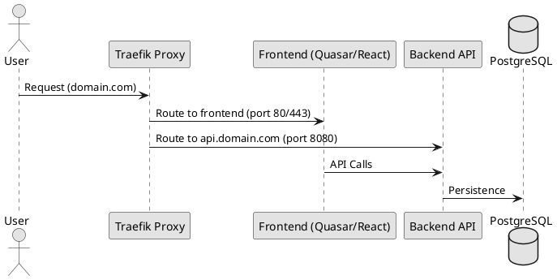

# Deployment Guidelines (Docker Compose & Traefik)

## 1. Architecture
We use Docker Compose for local development and small-scale deployments. Traefik acts as the edge router and reverse proxy, handling SSL termination and request routing to the frontend and backend.

## 2. Network Topology
All services must reside on a shared Docker network. Traefik communicates with services via Docker labels.



## 3. Docker Compose Configuration
Every project must provide a `docker-compose.yml` that follows these rules:

### 3.1 Traefik Setup
Traefik must be configured as the entry point.

```yaml
services:
  traefik:
    image: traefik:v2.10
    command:
      - "--providers.docker=true"
      - "--entrypoints.web.address=:80"
    ports:
      - "80:80"
      - "8080:8080" # Dashboard
    volumes:
      - /var/run/docker.sock:/var/run/docker.sock
```

### 3.2 Service Routing (Labels)
Services are discovered by Traefik using labels.

```yaml
services:
  backend:
    image: my-app-backend:latest
    labels:
      - "traefik.enable=true"
      - "traefik.http.routers.backend.rule=Host(`api.localhost`)"
      - "traefik.http.services.backend.loadbalancer.server.port=8080"

  frontend:
    image: my-app-frontend:latest
    labels:
      - "traefik.enable=true"
      - "traefik.http.routers.frontend.rule=Host(`localhost`)"
      - "traefik.http.services.frontend.loadbalancer.server.port=80"
```

## 4. Deployment Workflow
1. **Build**: Build images using `docker-compose build`.
2. **Up**: Start services with `docker-compose up -d`.
3. **Verify**: Check Traefik dashboard at `http://localhost:8080` to ensure routes are active.
4. **Logs**: Use `docker-compose logs -f [service]` to monitor startup.

## 5. Security & Production Notes
- **Secrets**: Use `.env` files or Docker secrets. Never commit passwords to `docker-compose.yml`.
- **Resource Limits**: Define `deploy.resources.limits` for CPU and Memory to prevent a single service from crashing the host.
- **Healthchecks**: Implement `healthcheck` in each service to allow Traefik to remove unhealthy instances from the load balancer.

## 6. Container Freshness Verification
All Docker images must include the current Git commit SHA as a label. This enables runtime verification that deployed containers match the code in the repository.

### 6.1 Dockerfile Requirements
Add the following to every service Dockerfile (both builder and runtime stages):

```dockerfile
ARG GIT_COMMIT=unknown
LABEL commit="$GIT_COMMIT"
```

### 6.2 Docker Compose Requirements
Pass the commit SHA as a build argument:

```yaml
services:
  my-service:
    build:
      context: .
      args:
        GIT_COMMIT: ${GIT_COMMIT:-unknown}
```

### 6.3 Deploy Script
Use `scripts/deploy.sh` for deployments:

```bash
# Deploy all services with build contexts
./scripts/deploy.sh

# Deploy specific services
./scripts/deploy.sh docker-compose.traefik.yml order-service-java nginx
```

This script:
1. Exports `GIT_COMMIT=$(git rev-parse --short HEAD)`
2. Runs `docker compose up --build -d`
3. Verifies each container's `commit` label matches `$GIT_COMMIT`
4. Fails with clear instructions if any container is stale

### 6.4 Manual Freshness Check
Verify a specific container outside of deploy:

```bash
./scripts/verify-container-freshness.sh <container_name>
```

Example output:
```
PASS: Container 'order-service-java' is fresh (a576903)
FAIL: Container 'nginx' is STALE
      Running:  96a7585
      Expected: a576903
      Fix: docker compose up --build -d nginx
```

### 6.5 CI Integration
The `deploy.yml` GitHub Actions workflow runs automatically on pushes to `main` that affect Docker files or compose configurations. It builds images, starts containers, and fails the pipeline if any container's commit label does not match `HEAD`.
