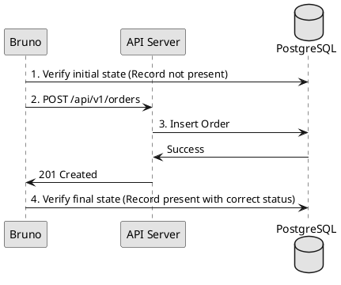

# Backend API Testing Guidelines (Bruno)

## 1. Strategy
We use Bruno for API testing. Bruno is preferred over Postman/Insomnia due to its filesystem-based storage, allowing tests to be version-controlled in Git.

## 2. Project Structure
API collections must be stored in the project root or backend directory to be shared across the team.

**Recommended Path**: `backend/api-tests/`

```
backend/api-tests/
├── environments/           # Environment variables (dev, staging, prod)
│   └── development.bru
├── collections/             # API Collections
│   ├── auth/
│   │   └── login.bru
│   └── orders/
│       └── create-order.bru
└── README.md
```

## 3. Database-Integrated Testing
API tests must verify the side effects in the database, not just the HTTP response.

### Verification Workflow
1. **Pre-condition**: Check initial DB state (e.g., via a dedicated `/test-helper` endpoint or direct SQL in a test script).
2. **Action**: Execute the API request via Bruno.
3. **Verification**: 
    - Assert HTTP status and response body.
    - Verify DB update (e.g., check that `Order` status changed to `PENDING`).

#### DB Verification Flow


## 4. Bruno Best Practices
- **Environments**: Use `{{baseUrl}}` and `{{token}}` variables. Never hardcode URLs or secrets.
- **Scripts**: Use Bruno's pre-request and post-response scripts for:
    - Extracting JWT tokens from login responses and saving them to environment variables.
    - Calculating checksums or timestamps for request signatures.
- **Assertions**: Use Bruno's built-in assertions for response codes, headers, and JSON path values.

## 5. CI/CD Integration
- API tests should be executed via `bru-cli` in the CI pipeline.
- A failure in API tests must block the merge of any backend change.
