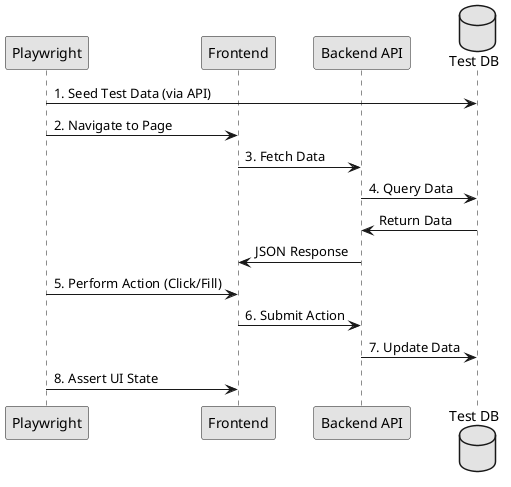

# E2E Frontend Testing Guidelines (Playwright)

## 1. Strategy
We use Playwright for end-to-end (E2E) testing to verify critical user journeys. Tests must simulate real user behavior, avoiding internal state manipulation.

## 2. Project Structure
Test cases must be stored within the frontend project directory to keep tests close to the code they verify.

**Recommended Path**: `frontend/tests/e2e/`

```
frontend/tests/e2e/
├── page-objects/           # Page Object Model (POM) classes
│   ├── LoginPage.ts
│   └── OrderPage.ts
├── specs/                   # Test specifications
│   ├── auth/
│   │   └── login.spec.ts
│   └── orders/
│   │   └── place-order.spec.ts
└── playwright.config.ts    # Global configuration
```

## 3. Implementation Patterns

### 3.1 Page Object Model (POM)
To avoid fragile tests, encapsulate page-specific selectors and actions into Page Objects.

```ts
// page-objects/LoginPage.ts
export class LoginPage {
    readonly page: Page;
    readonly emailInput = this.page.locator('input[name="email"]');
    readonly passwordInput = this.page.locator('input[name="password"]');
    readonly submitBtn = this.page.locator('button[type="submit"]');

    async login(email: string, pass: string) {
        await this.emailInput.fill(email);
        await this.passwordInput.fill(pass);
        await this.submitBtn.click();
    }
}
```

### 3.2 Test Isolation
- **State**: Each test must start from a clean state. Use `beforeEach` to clear cookies/localStorage or use a dedicated test user.
- **Data**: Use API calls in `beforeAll` to seed necessary data rather than relying on UI steps to set up state.

## 4. CI/CD Integration
- Tests must run on every PR in a headless browser.
- Use Playwright's `trace` and `screenshot` features on failure for debugging in CI logs.
- Critical paths (Smoke Tests) must be tagged as `@smoke` to run on every deployment.

## 5. Verification Flow

