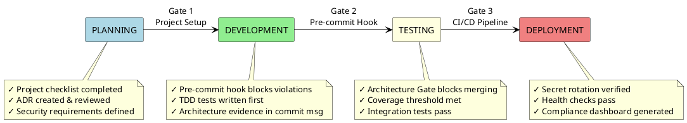

# Governance Model: Phase Gate Guardrails

**Mandatory compliance checks between every SDLC stage.** Code cannot progress without passing each gate.

---

## SDLC Flow Diagram



**Render Options:**
- **VS Code:** Install PlantUML extension, press `Alt+D` (Windows) / `Option+D` (Mac)
- **Online:** Copy diagram to https://www.plantuml.com/plantuml/
- **CLI:** `plantuml -tpng governance.md`

---

## Gate Details

| Stage Transition | Guardrail | Enforcement | Bypassable? |
|-----------------|-----------|-------------|-------------|
| **Planning → Development** | Project checklist completion | Manual (SOP) | ❌ No — required for new projects |
| **Development → Testing** | Pre-commit architecture hook | Git hook (automatic) | ❌ No — commit blocked |
| **Development → Testing** | Commit message with architecture evidence | Commit-msg hook | ❌ No — commit rejected |
| **Testing → Deployment** | Architecture Gate CI/CD | GitHub Actions | ❌ No — PR cannot merge |
| **Testing → Deployment** | Test coverage threshold | CI workflow | ❌ No — artifact required |
| **Deployment → Production** | Dual-version secret rotation | Automated script | ❌ No — zero-downtime required |
| **Production → Monitoring** | Compliance dashboard generation | Scheduled workflow | ⚠️ Auto-generated daily |
| **Any Stage** | Violation logging & escalation | Automated scripts | ❌ No — all attempts logged |

---

## What Happens If You Try to Bypass?

1. **Pre-commit hook blocks** the commit with specific violation details
2. **Commit-msg hook rejects** commits without "Architecture: PASSED" evidence
3. **CI/CD pipeline fails** — PR cannot merge until Architecture Gate passes
4. **Violation is logged** to `logs/architecture-violations.log`
5. **Escalation triggered** if repeated bypass attempts detected
6. **Dashboard reflects** the violation in compliance metrics

---

## Example: Blocked Commit

```bash
$ git commit -m "feat: add order validation"
🛡️  Architecture Guardrails Pre-Commit Check

  [1/4] Checking Java architecture...
  ❌ FAIL: Domain layer has framework imports
    - File: src/main/java/com/example/domain/Order.java
    - Import: import org.springframework.stereotype.Component

Commit blocked. Fix violations and re-run:
  ./scripts/architecture-pre-commit.sh
```

---

## Example: Successful Commit

```bash
$ git commit -m "feat: add order validation (#123)" -m "
- Added OrderValidator in domain layer
- Created validation use case in application layer

Architecture: ./scripts/architecture-pre-commit.sh PASSED
  - Duration: 2340ms
  - Java architecture: OK
  - Python architecture: OK
  - Frontend architecture: OK
"
✅ Commit accepted. Proceeding to CI/CD...
```

---

## Enforcement Mechanisms

### 1. Pre-Commit Hook (`scripts/architecture-pre-commit.sh`)

**What it checks:**
- Java: Forbidden imports in domain layer, ArchUnit tests
- Python: Framework imports in domain, architecture tests
- Frontend: Dependency-cruiser validation

**Installation:**
```bash
cp scripts/architecture-pre-commit.sh .git/hooks/pre-commit
chmod +x .git/hooks/pre-commit
```

### 2. Commit Message Hook (`scripts/validate-commit-message.sh`)

**What it checks:**
- Architecture compliance evidence in commit message
- Format: `Architecture: ./scripts/architecture-pre-commit.sh PASSED`
- Duration and stack status

**Installation:**
```bash
cp scripts/validate-commit-message.sh .git/hooks/commit-msg
chmod +x .git/hooks/commit-msg
```

### 3. CI/CD Architecture Gate (`.github/workflows/architecture-gate.yml`)

**What it checks:**
- Java: `mvn test -Dtest="*ArchUnit*,*LayersTest"`
- Python: `pytest tests/archunit/ -v`
- Frontend: `npm run depcruise -- --validate`

**When it runs:**
- On every PR to `main` or `develop`
- Blocks merge until all checks pass

### 4. Violation Logging (`scripts/log-architecture-violation.sh`)

**What it logs:**
- Violation type (e.g., `JAVA_DOMAIN_FRAMEWORK_IMPORT`)
- File path and description
- Timestamp and author

**Log location:**
```bash
logs/architecture-violations.log
```

### 5. Escalation Checking (`scripts/check-escalation.sh`)

**When it triggers:**
- 3+ violations in 7 days → Email to team lead
- 5+ violations in 7 days → Slack alert + GitHub issue
- 10+ violations in 7 days → Block deployments

---

## Compliance Dashboard

Auto-generated HTML dashboard showing:
- Violation counts by type
- Pass/fail rates by stack
- Trends over time
- Top violators (files/authors)

**Generation:**
```bash
# Manual
python scripts/generate-dashboard.py metrics.json dashboard/index.html

# Automatic (daily at 9 AM UTC)
# See: .github/workflows/generate-dashboard.yml
```

**View:** Deploy to GitHub Pages at `https://<username>.github.io/<repo>/dashboard/`

---

## Related Documentation

- [Features Overview](features.md) — Complete list of 40+ template features
- [Architecture Standards](01-standards/02-architecture.md) — Clean Architecture rules
- [Pre-Commit Hook Source](../../scripts/architecture-pre-commit.sh) — Hook implementation
- [Architecture Gate Workflow](../../.github/workflows/architecture-gate.yml) — CI/CD configuration

---

*Last Updated: 2026-05-28*
