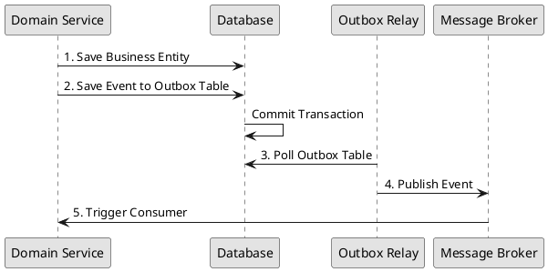

# ADR 003: Event-Driven Architecture and Outbox Pattern

**Status**: Accepted
**Date**: 2026-04-30

## Context
We need to synchronize data across bounded contexts without using distributed transactions (2PC), which are slow and prone to failure. We must guarantee that domain events are published if and only if the business transaction is committed.

## Decision
Implement an **Event-Driven Architecture (EDA)** using the **Transactional Outbox Pattern**.

### Implementation:
- **Outbox Table**: Domain events are written to a dedicated `outbox` table in the same transaction as the business data.
- **Relay**: A background poller or CDC (Change Data Capture) process reads from the outbox and publishes events to the message broker (Kafka/RabbitMQ).
- **Idempotent Consumers**: All event handlers must be idempotent to handle at-least-once delivery.

#### Outbox Flow Diagram

## Consequences
- **Positive**: Guaranteed eventual consistency and high availability. No distributed transaction locks.
- **Negative**: Increased complexity in the persistence layer and temporary lag (eventual consistency) between contexts.
- **Trade-off**: We accept eventual consistency in exchange for high system resilience and scalability.
