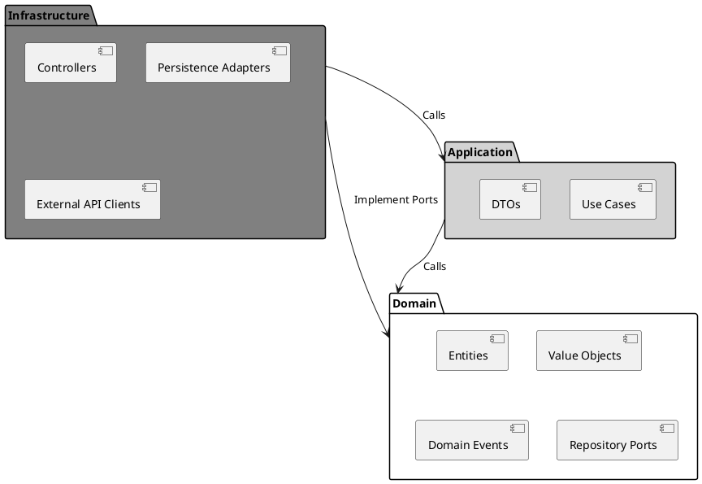

# Architecture Standards

## 1. Clean Architecture Principles

- **Domain-centric**: The domain layer has no external dependencies. Business rules live here.
- **Dependency Rule**: Inner layers do not know about outer layers. Dependencies point inward. Prohibit any import from `infrastructure` or `application` inside the `domain` layer.
- **CQS (Command Query Separation)**: Use Case classes must either return a result (Command) or return data (Query), never both.

### Dependency Flow Diagram

- **Layering**:
  1. **Domain/Entities**: Core business objects and rules. No framework dependencies.
  2. **Use Cases/Interactors**: Application-specific business rules. Orchestrate entities.
  3. **Interface Adapters**: Convert data between use cases and external agents (controllers, presenters, repositories).
  4. **Frameworks & Drivers**: UI, database, web frameworks, external APIs.
- **Ports and Adapters**: Define interfaces (ports) in inner layers. Implement them (adapters) in outer layers.
- **DTOs for boundaries**: Use Data Transfer Objects to pass data across layer boundaries.

## 2. Domain-Driven Design (DDD)

### 2.1 Ubiquitous Language
Use the same terminology in code, documentation, conversations, and UI. The domain model should reflect business language precisely.

### 2.2 Bounded Contexts
Define explicit boundaries around subdomains. Each context has its own domain model, repositories, and services. Map relationships between contexts explicitly.

### 2.3 Context Mapping
| Pattern | Description |
|---------|-------------|
| **Partnership** | Mutual dependency with coordinated planning. |
| **Shared Kernel** | Shared subset of the domain model. Version and evolve carefully. |
| **Customer-Supplier** | Upstream team prioritizes downstream needs. |
| **Conformist** | Downstream adapts to upstream model without negotiation. |
| **Anti-Corruption Layer (ACL)** | Protect your context from upstream changes using adapters and translators. |
| **Open Host Service** | Publish a well-defined API for other contexts to consume. |
| **Published Language** | Use a stable interchange format (shared event schema, OpenAPI spec). |

### 2.4 Aggregates
- Clusters of domain objects treated as a single unit.
- Root entity controls all access. External objects reference the aggregate root only.
- Enforce invariants within the aggregate boundary. Transactions span one aggregate at a time.
- Keep aggregates small. Large aggregates cause contention and performance issues.
- Aggregate root ID should be globally unique. Use UUIDs or natural business keys.

### 2.5 Entities
- Objects with identity that persists across state changes. Identity is defined by business business meaning, not technical ID.
- Protect invariants in constructors and methods. Never leave an entity in an invalid state.
- Use value objects for complex attributes (Money, Address, DateRange).

### 2.6 Value Objects
- Immutable, defined by their attributes alone. No identity.
- Prefer value objects over primitive types (e.g., `Email` over `String`).
- Two value objects with the same attributes are equal.
- Value objects can contain validation logic.

### 2.7 Domain Events
- Represent something significant that happened in the domain.
- Name events in past tense (`OrderPlaced`, `PaymentConfirmed`).
- Include event timestamp and correlation ID.
- Publish from aggregates or domain services, not infrastructure.
- Use the outbox pattern for reliable delivery across bounded contexts.

### 2.8 Domain Services
- Stateless operations that do not belong to any entity or value object.
- Use when a domain operation involves multiple aggregates or does not fit into an entity.
- Keep domain services in the domain layer. No framework dependencies.

### 2.9 Repositories (Ports)
- Abstract persistence of aggregates.
- Define repository interfaces in the domain layer.
- **Explicit Port Boundaries**: All repository interfaces must be defined in `domain` (as ports) and implemented in `infrastructure` (as adapters).
- Methods should return aggregates, not raw data structures.
- Only one repository per aggregate root.

### 2.10 Factories
Encapsulate complex object creation logic. Use static factory methods or dedicated factory classes.

### 2.11 Specifications
Encapsulate query criteria as reusable objects. Compose specifications for complex queries.

### 2.12 Strategic vs Tactical DDD
- **Strategic**: Focus on bounded contexts, context maps, and subdomain decomposition.
- **Tactical**: Use aggregates, entities, value objects, domain events, and services to model within a context.

## 3. Microservices Architecture

### 3.1 When to Use
Use when the domain is large enough to justify independent deployment, scaling, and team ownership. Do not start with microservices — begin with a modular monolith and extract services when boundaries are clear.

### 3.2 Service Boundaries
Align services with bounded contexts from DDD. Each service owns its data, domain logic, and deployment lifecycle.

### 3.3 Service Independence
- Each service has its own codebase, CI/CD pipeline, and database.
- Services communicate via well-defined APIs (REST, gRPC, or messaging).
- Avoid shared databases between services.

### 3.4 Communication Patterns
| Pattern | Use | Max Chain |
|---------|-----|-----------|
| REST/gRPC | Synchronous request-response | 2–3 services |
| Messaging | Event-driven, cross-context | Unlimited |
| Circuit Breaker | Resilience4j for synchronous calls | — |

- Set explicit timeouts on all external calls.
- Use exponential backoff with jitter for retries.

### 3.5 API Gateway
- Single entry point (Spring Cloud Gateway, Kong, Traefik).
- Handle cross-cutting concerns: auth, rate limiting, SSL termination, request routing.
- Do not put business logic in the gateway.

### 3.6 Service Discovery
- Use a service registry (Consul, Eureka, Kubernetes DNS).
- Health-check services and deregister unhealthy instances.

### 3.7 Configuration
- Externalize configuration per service.
- Use centralized config server (Spring Cloud Config) or environment variables.
- Store secrets in a secrets manager.

### 3.8 Data Consistency
- Accept eventual consistency between services.
- Use sagas for distributed transactions.
- Implement the outbox pattern for reliable event publishing across services.
- Use CQRS within a service only when justified by read/write ratio disparity.

### 3.9 Resilience
- Circuit breakers, bulkheads, rate limiters, retries via Resilience4j.
- Design for failure. Assume any dependency can fail.
- Provide fallback behavior (cached data, degraded functionality, queue for later processing).

### 3.10 Observability
- Distributed tracing: OpenTelemetry + Jaeger/Zipkin.
- Propagate correlation IDs through all service calls.
- Centralized logging (ELK, Loki, Datadog).
- Define SLOs per service (latency, availability, error rate).

### 3.11 Security
- Service-to-service auth: mTLS or short-lived JWT.
- Network policies: Rest la-inter-service communication (zero-trust).
- API gateway: Validate user tokens at edge, pass claims downstream.

### 3.12 Testing
- Unit tests: Domain logic in isolation.
- Integration tests: Service boundaries with Testcontainers.
- Contract tests: Pact or Spring Cloud Contract for API compatibility.
- E2E tests: Critical user flows across the full system. Keep minimal and fast.

### 3.13 Scaling
- Scale services independently based on load.
- Stateless services scale horizontally.
- Stateful services (databases, caches) scale with la-care.

### 3.14 Migration from Monolith
1. Identify bounded contexts and data ownership.
2. Extract one service at a time. Start with low-risk, well-understood contexts.
3. Use the strangler fig pattern: route traffic gradually via API gateway.
4. Maintain data consistency during migration using dual writes or CDC.

### 3.15 Documentation
- Service catalog: ownership, tech stack, dependencies, runbooks.
- Inter-service APIs: OpenAPI or AsyncAPI specs.
- Architecture diagrams: `docs/architecture/`.

## 4. Event-Driven Architecture (Deep Dive)

### 4.1 When to Use
- Loose coupling between bounded contexts.
- Async processing.
- Decoupling write and read models (CQRS).

### 4.2 Domain Events
- Immutable records in the domain layer.
- Publish from aggregates or use cases, not from infrastructure.
- Past tense naming. Include timestamp and correlation ID.
- Include only necessary data. Do not include full aggregates.

### 4.3 Event Publishing
- Use the **outbox pattern**: write events to an outbox table in the same transaction as business data.
- Use a background poller or CDC (Change Data Capture) to publish from the outbox.
- Avoid publishing directly from `@Transactional` methods without the outbox pattern.

### 4.4 Message Broker
- Use a persistent broker (Kafka, RabbitMQ) for critical events.
- Configure at-least-once delivery. Implement idempotent consumers.
- Use dead-letter queues (DLQ) for failed messages. Monitor DLQ size.
- Set appropriate retention policies. Document message TTL.

### 4.5 Event Consumption
- Implement idempotent handlers. Same event may be delivered multiple times.
- Handle events asynchronously. Do not block the publisher.
- Validate event schema on consumption. Reject malformed events to DLQ.
- Map integration events to domain commands in the consuming context.

### 4.6 Sagas
- For long-running transactions across contexts.
- Document saga flow and compensation logic.
- Choreography or orchestration based on complexity.

### 4.7 Testing
- Test event publishing and consumption in integration tests.
- Use embedded broker (Testcontainers for Kafka) in-memory broker for tests.

## 8. Data Integrity & Consistency
(Existing content)

## 9. Reliability & Performance
(Existing content)

## 2. Domain-Driven Design (DDD)

### 2.1 Ubiquitous Language

Use the same terminology in code, documentation, conversations, and UI. The domain model should reflect business language precisely.

### 2.2 Bounded Contexts

Define explicit boundaries around subdomains. Each context has its own domain model, repositories, and services. Map relationships between contexts explicitly.

### 2.3 Context Mapping

| Pattern | Description |
|---------|-------------|
| **Partnership** | Mutual dependency with coordinated planning. |
| **Shared Kernel** | Shared subset of the domain model. Version and evolve carefully. |
| **Customer-Supplier** | Upstream team prioritizes downstream needs. |
| **Conformist** | Downstream adapts to upstream model without negotiation. |
| **Anti-Corruption Layer (ACL)** | Protect your context from upstream changes using adapters and translators. |
| **Open Host Service** | Publish a well-defined API for other contexts to consume. |
| **Published Language** | Use a stable interchange format (shared event schema, OpenAPI spec). |

### 2.4 Aggregates

- Clusters of domain objects treated as a single unit.
- Root entity controls all access. External objects reference the aggregate root only.
- Enforce invariants within the aggregate boundary. Transactions span one aggregate at a time.
- Keep aggregates small. Large aggregates cause contention and performance issues.
- Aggregate root ID should be globally unique. Use UUIDs or natural business keys.

### 2.5 Entities

- Objects with identity that persists across state changes. Identity is defined by business meaning, not technical ID.
- Protect invariants in constructors and methods. Never leave an entity in an invalid state.
- Use value objects for complex attributes (Money, Address, DateRange).

### 2.6 Value Objects

- Immutable, defined by their attributes alone. No identity.
- Prefer value objects over primitive types (e.g., `Email` over `String`).
- Two value objects with the same attributes are equal.
- Value objects can contain validation logic.

### 2.7 Domain Events

- Represent something significant that happened in the domain.
- Name events in past tense (`OrderPlaced`, `PaymentConfirmed`).
- Include event timestamp and correlation ID.
- Publish from aggregates or domain services, not infrastructure.
- Use the outbox pattern for reliable delivery across bounded contexts.

### 2.8 Domain Services

- Stateless operations that do not belong to any entity or value object.
- Use when a domain operation involves multiple aggregates or does not fit into an entity.
- Keep domain services in the domain layer. No framework dependencies.

### 2.9 Repositories (Ports)

- Abstract persistence of aggregates.
- Define repository interfaces in the domain layer.
- **Explicit Port Boundaries**: All repository interfaces must be defined in `domain` (as ports) and implemented in `infrastructure` (as adapters).
- Methods should return aggregates, not raw data structures.
- Only one repository per aggregate root.

### 2.10 Factories

Encapsulate complex object creation logic. Use static factory methods or dedicated factory classes.

### 2.11 Specifications

Encapsulate query criteria as reusable objects. Compose specifications for complex queries.

### 2.12 Strategic vs Tactical DDD

- **Strategic**: Focus on bounded contexts, context maps, and subdomain decomposition.
- **Tactical**: Use aggregates, entities, value objects, domain events, and services to model within a context.

## 3. Microservices Architecture

### 3.1 When to Use

Use when the domain is large enough to justify independent deployment, scaling, and team ownership. Do not start with microservices — begin with a modular monolith and extract services when boundaries are clear.

### 3.2 Service Boundaries

Align services with bounded contexts from DDD. Each service owns its data, domain logic, and deployment lifecycle.

### 3.3 Service Independence

- Each service has its own codebase, CI/CD pipeline, and database.
- Services communicate via well-defined APIs (REST, gRPC, or messaging).
- Avoid shared databases between services.

### 3.4 Communication Patterns

| Pattern | Use | Max Chain |
|---------|-----|-----------|
| REST/gRPC | Synchronous request-response | 2–3 services |
| Messaging | Event-driven, cross-context | Unlimited |
| Circuit Breaker | Resilience4j for synchronous calls | — |

- Set explicit timeouts on all external calls.
- Use exponential backoff with jitter for retries.

### 3.5 API Gateway

- Single entry point (Spring Cloud Gateway, Kong, Traefik).
- Handle cross-cutting concerns: auth, rate limiting, SSL termination, request routing.
- Do not put business logic in the gateway.

### 3.6 Service Discovery

- Use a service registry (Consul, Eureka, Kubernetes DNS).
- Health-check services and deregister unhealthy instances.

### 3.7 Configuration

- Externalize configuration per service.
- Use centralized config server (Spring Cloud Config) or environment variables.
- Store secrets in a secrets manager.

### 3.8 Data Consistency

- Accept eventual consistency between services.
- Use sagas for distributed transactions.
- Implement the outbox pattern for reliable event publishing across services.
- Use CQRS within a service only when justified by read/write ratio disparity.

### 3.9 Resilience

- Circuit breakers, bulkheads, rate limiters, retries via Resilience4j.
- Design for failure. Assume any dependency can fail.
- Provide fallback behavior (cached data, degraded functionality, queue for later processing).

### 3.10 Observability

- Distributed tracing: OpenTelemetry + Jaeger/Zipkin.
- Propagate correlation IDs through all service calls.
- Centralized logging (ELK, Loki, Datadog).
- Define SLOs per service (latency, availability, error rate).

### 3.11 Security

- Service-to-service auth: mTLS or short-lived JWT.
- Network policies: Restrict inter-service communication (zero-trust).
- API gateway: Validate user tokens at edge, pass claims downstream.

### 3.12 Testing

- Unit tests: Domain logic in isolation.
- Integration tests: Service boundaries with Testcontainers.
- Contract tests: Pact or Spring Cloud Contract for API compatibility.
- E2E tests: Critical user flows across the full system. Keep minimal and fast.

### 3.13 Scaling

- Scale services independently based on load.
- Stateless services scale horizontally.
- Stateful services (databases, caches) scale with care.
- Use central message broker for backpressure handling.

### 3.14 Migration from Monolith

1. Identify bounded contexts and data ownership.
2. Extract one service at a time. Start with low-risk, well-understood contexts.
3. Use the strangler fig pattern: route traffic gradually via API gateway.
4. Maintain data consistency during migration using dual writes or CDC.

### 3.15 Documentation

- Service catalog: ownership, tech stack, dependencies, runbooks.
- Inter-service APIs: OpenAPI or AsyncAPI specs.
- Architecture diagrams: `docs/architecture/`.

## 4. Event-Driven Architecture (Deep Dive)

### 4.1 When to Use

- Loose coupling between bounded contexts.
- Async processing.
- Decoupling write and read models (CQRS).

### 4.2 Domain Events

- Immutable records in the domain layer.
- Publish from aggregates or use cases, not from infrastructure.
- Past tense naming. Include timestamp and correlation ID.
- Include only necessary data. Do not include full aggregates.

### 4.3 Event Publishing

- Use the **outbox pattern**: write events to an outbox table in the same transaction as business data.
- Use a background poller or CDC (Change Data Capture) to publish from the outbox.
- Avoid publishing directly from `@Transactional` methods without the outbox pattern.

### 4.4 Message Broker

- Use a persistent broker (Kafka, RabbitMQ) for critical events.
- Configure at-least-once delivery. Implement idempotent consumers.
- Use dead-letter queues (DLQ) for failed messages. Monitor DLQ size.
- Set appropriate retention policies. Document message TTL.

### 4.5 Event Consumption

- Implement idempotent handlers. Same event may be delivered multiple times.
- Handle events asynchronously. Do not block the publisher.
- Validate event schema on consumption. Reject malformed events to DLQ.
- Map integration events to domain commands in the consuming context.

### 4.6 Sagas

- For long-running transactions across contexts.
- Document saga flow and compensation logic.
- Choreography or orchestration based on complexity.

### 4.7 Testing

- Test event publishing and consumption in integration tests.
- Use embedded broker (Testcontainers for Kafka) or in-memory broker for tests.

## 8. Data Integrity & Consistency

### 8.1 Concurrency Control
- **Optimistic Locking**: Use for most aggregates. Add a `@Version` column to entities to prevent lost updates. Throw `OptimisticLockingFailureException` on conflict.
- **Pessimistic Locking**: Use only for high-contention resources where conflicts are frequent. Use `PESSIMISTIC_WRITE` in JPA repositories to lock rows during the transaction.

### 8.2 Multi-tenancy Strategy
- **Strategy**: Use **Schema-per-tenant** for strong isolation and regulatory compliance.
- **Implementation**: Configure a `CurrentTenantIdentifierResolver` in Hibernate to switch schemas dynamically based on the authenticated user's context.
- **Migration**: Run Flyway migrations across all tenant schemas using a loop in the deployment pipeline.

## 9. Reliability & Performance

### 9.1 Distributed Tracing
- **Standard**: Use OpenTelemetry for all service-to-service communication.
- **Propagation**: Every request must carry a `X-Correlation-ID`. If absent, the API Gateway must generate one.
- **Logging**: All logs must include the `correlation-id` in the MDC (Mapped Diagnostic Context) for end-to-end request tracing.

### 9.2 Feature Toggling
- **Pattern**: Use a "Dark Launch" strategy to decouple deployment from release.
- **Implementation**: Store toggles in a centralized config (e.g., Spring Cloud Config or a database table).
- **Lifecycle**: Toggles must be short-lived. Create a "Tidying" task to remove the toggle and the dead code path once the feature is 100% rolled out.
